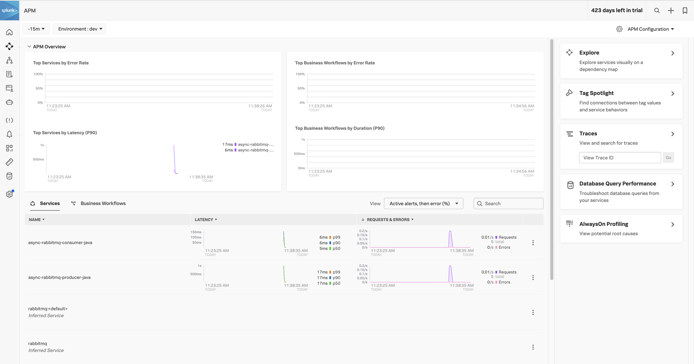
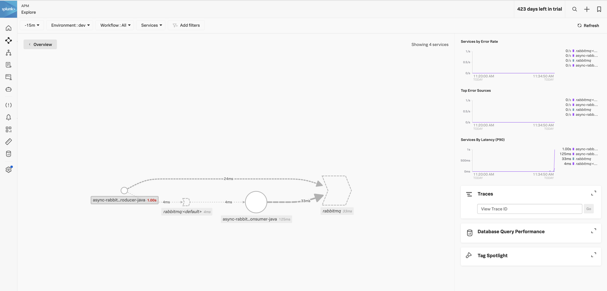
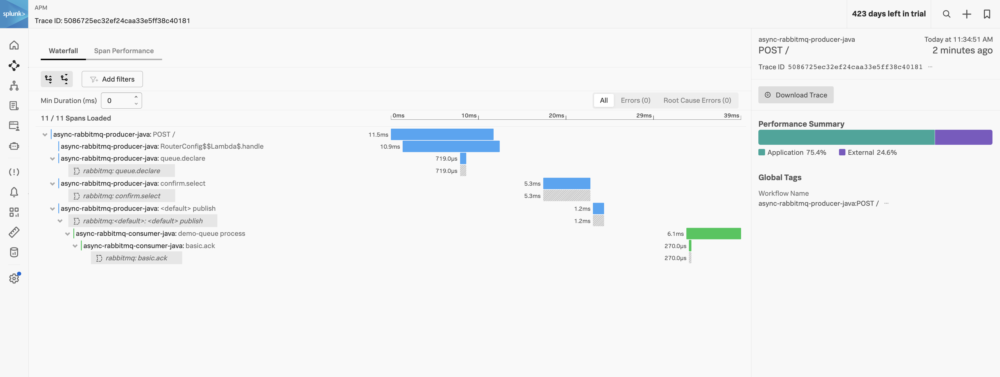
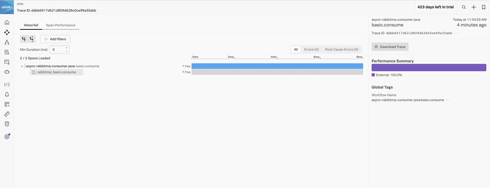

# Asynchronous RabbitMQ OpenTelemetry

Objective of this repository is to understand how Spring Webflux + RabbitMQ traces behavior when sent into the Splunk O11y. 

The repository is cloned from this [article](https://medium.com/@jcrmorelli/how-to-implement-reactor-rabbitmq-in-your-reactive-spring-boot-application-part-2-733564b9f6d5)

## Pre-Requisite

Maven and Java compiler version.

```bash
➜  order-service mvn --version
Apache Maven 3.8.6 (84538c9988a25aec085021c365c560670ad80f63)
Maven home: /usr/local/Cellar/maven/3.8.6/libexec
Java version: 18.0.2.1, vendor: Homebrew, runtime: /usr/local/Cellar/openjdk/18.0.2.1/libexec/openjdk.jdk/Contents/Home
Default locale: en_GB, platform encoding: UTF-8
OS name: "mac os x", version: "13.5.1", arch: "x86_64", family: "mac"

➜  order-service java --version
openjdk 19.0.1 2022-10-18
OpenJDK Runtime Environment (build 19.0.1+10-21)
OpenJDK 64-Bit Server VM (build 19.0.1+10-21, mixed mode, sharing)

```


## To Run

1. Run the OTEL collector in the background.
2. Build both the modules with `mvn clean package`
3. Start RabbitMQ docker   

```bash
docker run -it --rm --name rabbitmq -p 5672:5672 -p 15672:15672 rabbitmq:3.9-management
```

4. Start the publisher with the `start-publisher.sh` script
5. Start the consumer with the `start-consumer.sh` script
6. POST payload the publisher endpoint `http://localhost:8001`

```json
{
    "items": [
        {
            "name" : "item 5",
            "price":  2.15
        }
    ]
}
```

7. Consumer will consume the payload

```bash
2023-08-31T11:34:35.144+08:00  INFO 80385 --- [           main] c.a.d.DatabaseManagerApplication         : Started DatabaseManagerApplication in 3.47 seconds (process running for 5.72)
{"id":null,"items":[{"name":"item 3","price":2.13}],"totalCost":2.13}
2.13
{"id":null,"items":[{"name":"item 3","price":2.13}],"totalCost":2.13}
2.13
{"id":null,"items":[{"name":"item 1","price":2.11}],"totalCost":2.11}
2.11
{"id":null,"items":[{"name":"item 2","price":2.12}],"totalCost":2.12}
2.12
```

## Splunk O11y APM





Publish Trace Flow `5086725ec32ef24caa33e5ff38c40181`


Consume Trace Flow `ddbb6917d621d809d628c0ce99a30abb`

